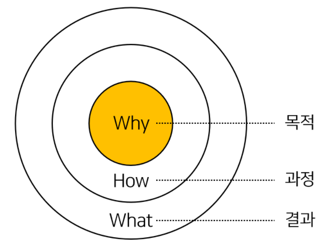

## 2장  | 앞으로 필요한 건 데이터 문해력: 분석보다 활용
### [부제] 목적 사고력: 목적에 맞게 문제와 데이터를 연결하기  

데이터 분석에 있어 오류에 빠지는 주요 원인은 분석 방법론보다도 
`1) 문제 정의의 불명확성`, `2) 정의한 문제와 사용하는 데이터의 불일치성` 이다.  

데이터 분석을 효율적으로 하는 방법은 데이터에서 무엇을 알 수 있을지 먼저 생각하는 것이다.
데이터를 가공, 전처리 하고 나면 어떤 결론이라도 나겠지, 하고 생각했던 지난 날들을 되돌아 보게 된다. 🤦  
  
어떻게 할지를 생각하는 것 (How to) 보다 중요한 것은 '목적과 문제에 대한 정의'이다.  
즉, Why가 중요한데 이 것은 직접적인 연관은 아니지만 사이먼 시넥의 '골든 서클'을 떠올리게 한다.  

- 골든 서클  
  

#### 1. Are you solving the right problem?
- 문제 정의란
  2가지를 명확히 하는 것
  1. 나는 무엇을 알고 싶은가
  2. 나는 무엇을 해결하고자 하는가

- 문제 정의를 할 때 확인해야 할 것
  1. 사용된 언어가 구체적이고 명확한가  
  무엇이 문제이며 구체적으로 어떻게 문제가 발생한 건지를 명확히 해야 한다.  
  또 문제를 정의하는 용어를 구체적으로 하자.  
  > ex) 유연한 근무 환경에는 장소의 유연성, 임직원 채용의 유연성, 역할과 평가제도의 유연성 등 다양한 요소가 있음  
  또 이 구체성을 위해 데이터 분석에 있어 도메인 지식이 더욱 중요함을 느끼게 되었다.

  2. 문제, 원인, 해결방안을 구분하고 있는가  
  무엇을 문제로 정의할 것인지 고민하자.  
  또 분석을 하기 전에 추측으로 원인을 단정하지 말자.  

#### 2. Are you using the right data?  
목적, 문제를 명확히 하면 그 다음에 할 일은 이에 맞는 데이터를 찾는 일이다.  
기존 데이터를 전제로 결론을 내고, 이에 주관적인 해석을 개입시키는 것을 피해야 한다는 것을 깨닫게 되었다.  

예를 들어 *학생 식당의 질*을 평가하려고 할 때, 질의 요소에 무엇이 있는지를 정의해야 할 것이다. 
(가격, 입지조건, 메뉴종류수, 메뉴 변경빈도 등)  

- 결론 도출의 프로세스와 프레젠테이션 순서의 차이점  
  - 결론 도출 프로세스: 평가 지표 및 기준 결정 >> 적합한 데이터 선정 >> 결론  
  - 프레젠테이션 순서: 결론 >> 평가 지표 및 기준 결정 >> 적합한 데이터 선정
